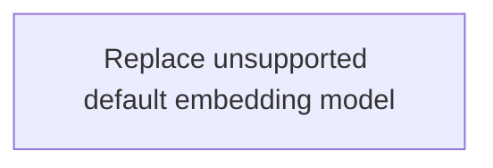

# Implementation Plan: Embedding Model 404 Fix

**Created:** 2026-02-12
**Status:** Completed
**Total Features:** 1
**Completed:** 1/1

## Progress Summary

| ID | Feature | Status | Dependencies | Priority |
|----|---------|--------|--------------|----------|
| 01 | Replace unsupported default embedding model | ✅ Completed | - | High |

## Dependency Graph

## Notes

- Source plan: `00-original-plan.md`
- Verification completed with direct embedding call (`OK 1 3072`).
