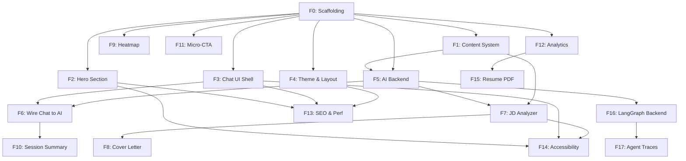

# Implementation Plan: Jason.AI Interactive AI Resume Platform

**Created:** 2026-02-09
**Status:** Completed
**Total Features:** 18 (F0-F17)
**Completed:** 18/18

## Progress Summary

| ID | Feature | Tier | Status | Dependencies | Complexity |
|----|---------|------|--------|--------------|------------|
| F0 | Project Scaffolding & Design System | 0 | ✅ Completed | - | S |
| F1 | Content System (loader + templates) | 0 | ✅ Completed | F0 | S |
| F2 | Hero Section | 1 | ✅ Completed | F0 | M |
| F3 | Chat UI Shell (no AI) | 1 | ✅ Completed | F0 | L |
| F4 | Theme Toggle & Layout | 1 | ✅ Completed | F0 | S |
| F5 | AI Chat Backend (Route Handlers) | 2 | ✅ Completed | F0, F1 | L |
| F6 | Wire Chat UI to AI | 2 | ✅ Completed | F3, F5 | M |
| F7 | JD Analyzer | 3 | ✅ Completed | F0, F1, F5 | L |
| F8 | Cover Letter Generator | 3 | ✅ Completed | F7 | S |
| F9 | Contribution Heatmap | 4 | ✅ Completed | F0 | M |
| F10 | Session Summary | 4 | ✅ Completed | F6 | M |
| F11 | Micro-Commitment CTA | 4 | ✅ Completed | F0 | S |
| F12 | Analytics & UTM Tracking | 4 | ✅ Completed | F0 | S |
| F13 | SEO, OG Tags, Performance | 5 | ✅ Completed | F2, F3, F4 | S |
| F14 | Accessibility Audit | 5 | ✅ Completed | F2, F3, F7 | M |
| F15 | Resume PDF Download | 5 | ✅ Completed | F12 | S |
| F16 | FastAPI + LangGraph Backend | 6 | ✅ Completed | F5 | L |
| F17 | Agent Traces (LangSmith) | 6 | ✅ Completed | F16 | M |

## Implementation Sprints

| Sprint | Days | Features | Focus |
|--------|------|----------|-------|
| 1 | 1-2 | F0, F1, F4 | Foundation + content system |
| 2 | 3-5 | F2, F3, F12 | Core UI + analytics |
| 3 | 6-8 | F5, F6 | AI integration |
| 4 | 9-11 | F7, F8 | JD analysis + cover letters |
| 5 | 12-14 | F9, F10, F11, F13, F14, F15 | Engagement + polish |
| Phase 2 | Post-launch | F16, F17 | LangGraph backend + agent traces |

## Dependency Graph

## Parallel Tracks

### Track A: Foundation (Sprint 1) ✅
✅ F0 → ✅ F1 → ✅ F4

### Track B: Core UI (Sprint 2, after F0) ✅
✅ F2 (Hero) | ✅ F3 (Chat) | ✅ F12 (Analytics)

### Track C: AI Integration (Sprint 3, after F1+F3) ✅
✅ F5 → ✅ F6

### Track D: JD Analysis (Sprint 4, after F5) ✅
✅ F7 → ✅ F8

### Track E: Engagement (Sprint 5, after F6) ✅
✅ F9 | ✅ F10 | ✅ F11 | ✅ F13 | ✅ F14 | ✅ F15

### Track F: Phase 2 (Post-Launch) ✅
✅ F16 → ✅ F17

## Milestones

- [x] **M1: Foundation Ready** (F0, F1, F4) — `pnpm dev` starts, content loads, theme works
- [x] **M2: UI Complete** (F2, F3) — Hero + chat render with mock data, mobile responsive
- [x] **M3: AI Live** (F5, F6) — Streamed AI responses, follow-up chips, conversation memory
- [x] **M4: JD Analysis** (F7, F8) — Paste JD → score + cover letter
- [x] **M5: Launch Ready** (F9-F15) — Heatmap, analytics, SEO, a11y, PDF download
- [x] **M6: Phase 2** (F16, F17) — LangGraph backend + agent traces

## Verification Plan

| Milestone | Verification |
|-----------|-------------|
| M1 | `pnpm dev` starts, theme toggle works, content loads from markdown |
| M2 | Hero renders with count-up animations, chat works with mock data, responsive mobile |
| M3 | Send message → streamed AI response, follow-up chips appear, conversation memory |
| M4 | Paste JD → animated score + strengths/gaps, generate cover letter |
| M5 | Heatmap renders, session summary generates, Lighthouse 90+, axe-core passes |
| M6 | LangGraph graph execution, LangSmith traces visible |

## Status Legend

- ⬜ **Not Started** - Feature not yet begun
- ⏳ **In Progress** - Actively being worked on
- ✅ **Completed** - Feature finished and verified
- ⏸️ **Blocked** - Waiting on dependencies
- ⚠️ **Issues** - Requires attention

## Notes

- **Stack:** Next.js 16 App Router, TypeScript, Tailwind CSS v4, shadcn/ui, Geist fonts, Gemini 2.0 Flash
- **Architecture:** Client-side-first with Next.js route handlers as MVP backend
- **Phase 2:** FastAPI + LangGraph on Cloud Run (same API contract, frontend unchanged)
- **Content:** First-person conversational tone with Situation/Action/Result/Real Talk structure
- **Layout:** Horizontal category pills + full-width chat (not sidebar)

---

**Created:** 2026-02-09
**Last Updated:** 2026-02-10
