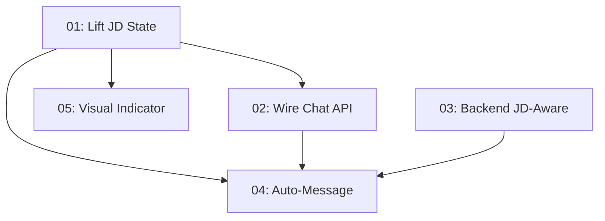

# Implementation Plan: JD-Aware Chat

**Created:** 2026-02-13
**Status:** Completed
**Total Features:** 5
**Completed:** 5/5

## Progress Summary

| ID | Feature | Status | Dependencies | Priority |
|----|---------|--------|--------------|----------|
| 01 | Lift JD State from Modal to ChatSection | ✅ Completed | - | High |
| 02 | Wire JD Context into Chat API | ✅ Completed | 01 | High |
| 03 | Backend JD-Aware Chat Responses | ✅ Completed | - | High |
| 04 | "Discuss in Chat" Auto-Message | ✅ Completed | 01, 02 | Medium |
| 05 | Visual Indicator + Empty State Nudge | ✅ Completed | 01 | Medium |

## Dependency Graph

## Files Modified

| File | Phases |
|------|--------|
| `frontend/src/types/jd-analysis.ts` | 01 |
| `frontend/src/app/page.tsx` | 01 |
| `frontend/src/components/hero/hero-section.tsx` | 01 |
| `frontend/src/components/hero/hero-cta-buttons.tsx` | 01 |
| `frontend/src/components/jd-analyzer/jd-analyzer-modal.tsx` | 01 |
| `frontend/src/components/chat/chat-section.tsx` | 01, 04 |
| `frontend/src/hooks/use-chat.ts` | 02 |
| `frontend/src/app/api/chat/route.ts` | 02 |
| `backend/main.py` | 03 |
| `backend/graph/nodes/qa.py` | 03 |
| `backend/prompts/templates.py` | 03 |
| `frontend/src/components/chat/chat-main.tsx` | 05 |
| `frontend/src/components/chat/chat-empty-state.tsx` | 05 |

## Verification Checklist

- [x] No regression: Chat without JD works identically to before
- [x] Full flow: Paste JD -> Analyze -> "Discuss in Chat" -> first response references JD
- [x] Ongoing context: Follow-up questions in same session remain JD-aware
- [x] Dismiss: Clicking dismiss on JD chip clears context and reverts to generic mode
- [x] Backend: qa_node only injects JD when job_description is non-empty
- [x] Fallback: Frontend direct-Gemini path (no backend) also works with JD

## Notes

- Phase 4 (auto-message) was implemented inside Phase 1 since the `useEffect` naturally lives in `chat-section.tsx`
- `sentJdRef` prevents React strict mode double-fires for the auto-send
- JD context persists on back-to-hero navigation (intentional: user can return to continue JD-aware chat)
- Dismiss X button on JD chip is the canonical way to clear context
