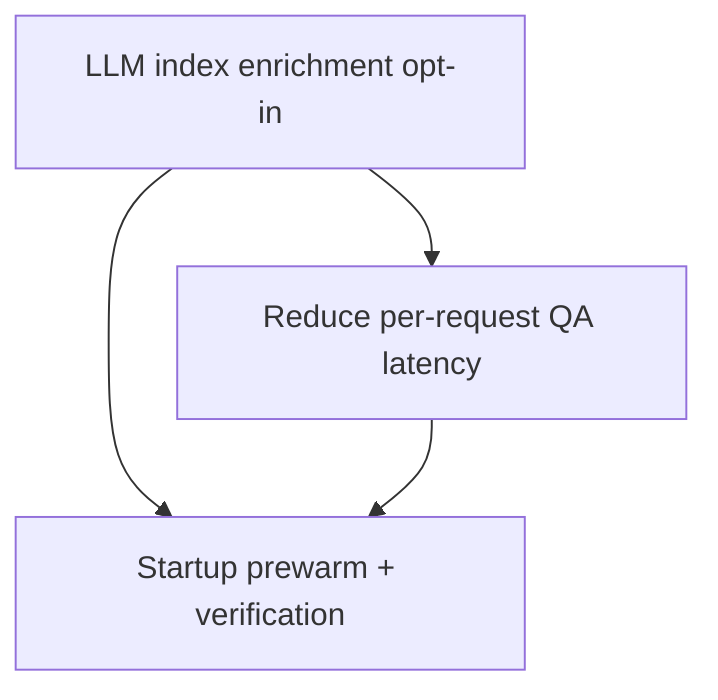

# Implementation Plan: Chat Latency Optimization

**Created:** 2026-02-12
**Status:** Completed
**Total Features:** 3
**Completed:** 3/3

## Progress Summary

| ID | Feature | Status | Dependencies | Priority |
|----|---------|--------|--------------|----------|
| 01 | Make LLM index enrichment opt-in | ✅ Completed | - | High |
| 02 | Reduce per-request QA latency | ✅ Completed | 01 | High |
| 03 | Startup prewarm + verification | ✅ Completed | 01, 02 | Medium |

## Dependency Graph

## Notes

- Source plan: `00-original-plan.md`
- Optimize first-request and steady-state latency while preserving behavior controls.
- Runtime benchmark after changes: cold ~6.9s, warm ~4.4s for category QA path.
