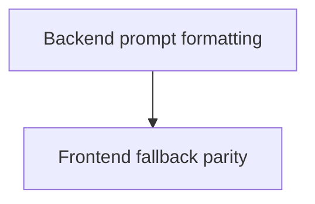

# Implementation Plan: Recruiter-Friendly Chat Output Format

**Created:** 2026-02-12
**Status:** Completed
**Total Features:** 2
**Completed:** 2/2

## Progress Summary

| ID | Feature | Status | Dependencies | Priority |
|----|---------|--------|--------------|----------|
| 01 | Backend prompt formatting rules | ✅ Completed | - | High |
| 02 | Frontend fallback prompt parity | ✅ Completed | 01 | Medium |

## Dependency Graph

## Notes

- Source plan: `00-original-plan.md`
- Runtime QA sample confirms sectioned output (`Snapshot`, `Key Wins`, etc.).
