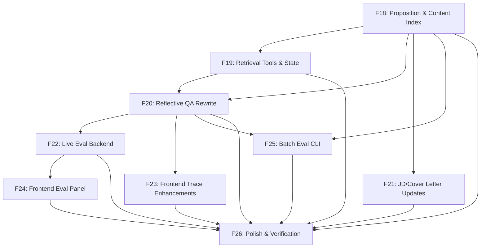

# Implementation Plan: Reflective Agentic Retrieval Architecture

**Created:** 2026-02-10
**Status:** Completed
**Total Features:** 9 (F18-F26)
**Completed:** 9/9

## Summary

Replace the current "dump all content into the prompt" backend with a **Reflective Agentic Retrieval** system combining 4 techniques: Proposition Indexing, Adaptive Self-RAG, A-RAG Hierarchical Tools, and CRAG Corrective Loop. Includes a live A/B evaluation system comparing reflective vs naive retrieval on every query.

## Progress Summary

| ID | Feature | Status | Dependencies | Complexity |
|----|---------|--------|--------------|------------|
| F18 | Proposition & Content Index | ✅ Completed | F16, F17 | L |
| F19 | Retrieval Tools & State Updates | ✅ Completed | F18 | M |
| F20 | Reflective QA Rewrite | ✅ Completed | F18, F19 | L |
| F21 | JD Analyzer & Cover Letter Updates | ✅ Completed | F18 | S |
| F22 | Live Eval Backend | ✅ Completed | F20 | L |
| F23 | Frontend Trace Enhancements | ✅ Completed | F20 | M |
| F24 | Frontend Eval Comparison Panel | ✅ Completed | F22 | M |
| F25 | Batch Eval CLI | ✅ Completed | F18, F20 | M |
| F26 | Polish & Verification | ✅ Completed | F18-F25 | S |

## Dependency Graph

## Milestones

- [x] **M7: Index Ready** (F18) — Propositions extracted, embeddings computed, content index queryable
- [x] **M8: Retrieval Live** (F19, F20) — Reflective assess/retrieve/evaluate loop working
- [x] **M9: All Nodes Updated** (F21) — JD analyzer + cover letter use ContentIndex
- [x] **M10: Eval System** (F22, F24, F25) — Live A/B comparison on every query + batch CLI
- [x] **M11: Full Polish** (F23, F26) — Enhanced trace panel, all verifications passing

## Verification Results

| Check | Result |
|-------|--------|
| Backend imports | All modules import successfully |
| `pnpm build` | Passes (0 errors) |
| `tsc --noEmit` | Passes (0 errors) |
| TraceStep fields | 10 fields including 5 new retrieval fields |
| Eval dataset | 50 questions across 5 tiers |
| SSE events | text, followUps, trace, eval, done, error |

## Files Created

### Backend
- `backend/graph/tools/proposition_index.py` — Proposition extraction + keyword extraction
- `backend/graph/tools/content_index.py` — Unified ContentIndex with keyword/semantic search
- `backend/graph/tools/retrieval_tools.py` — A-RAG tools: quick_scan, deep_retrieve, full_context
- `backend/prompts/retrieval_prompts.py` — ASSESS, EVALUATE, DECOMPOSE prompts
- `backend/eval/__init__.py` — Eval package
- `backend/eval/shadow_runner.py` — Naive shadow pipeline
- `backend/eval/judge.py` — LLM-as-judge (faithfulness, relevance, precision)
- `backend/eval/metrics.py` — StrategyMetrics, EvalComparison dataclasses
- `backend/eval/dataset.py` — 50 curated eval questions
- `backend/eval/runner.py` — Batch eval CLI runner

### Frontend
- `frontend/src/components/chat/eval-comparison.tsx` — A/B comparison panel

## Files Modified

### Backend
- `backend/config.py` — Added `embedding_model` setting
- `backend/requirements.txt` — Added `numpy`
- `backend/graph/state.py` — Extended TraceStep with 5 retrieval fields
- `backend/graph/nodes/qa.py` — Complete rewrite: 3-phase reflective pipeline
- `backend/graph/nodes/jd_analyzer.py` — Uses ContentIndex instead of get_all_content()
- `backend/graph/nodes/cover_letter.py` — Uses ContentIndex instead of get_all_content()
- `backend/main.py` — Shadow pipeline + eval comparison + eval SSE event

### Frontend
- `frontend/src/lib/sse-client.ts` — Extended TraceStep, added EvalComparisonData, added eval event type
- `frontend/src/types/chat.ts` — Added eval field to ChatMessage
- `frontend/src/hooks/use-chat.ts` — Handles eval SSE event
- `frontend/src/components/chat/trace-panel.tsx` — Confidence gauge, source badges, pipeline visualization
- `frontend/src/components/chat/chat-main.tsx` — Renders eval comparison panel

---

**Created:** 2026-02-10
**Last Updated:** 2026-02-10
