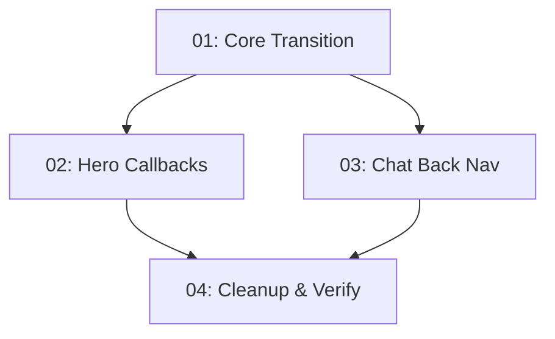

# Implementation Plan: Full-Page Slide Transition

**Created:** 2026-02-10
**Status:** Completed
**Total Features:** 4
**Completed:** 4/4

## Progress Summary

| ID | Feature | Status | Dependencies | Priority |
|----|---------|--------|--------------|----------|
| 01 | Core Transition Orchestration (page.tsx) | ✅ Completed | - | High |
| 02 | Hero Callback Wiring | ✅ Completed | 01 | High |
| 03 | Chat Back Navigation | ✅ Completed | 01 | High |
| 04 | Cleanup & Verification | ✅ Completed | 01, 02, 03 | Medium |

## Dependency Graph

## Parallel Tracks

### Track A: Hero Side (Features 01 → 02)
✅ 01 Core Transition → ✅ 02 Hero Callbacks

### Track B: Chat Side (Features 01 → 03)
✅ 01 Core Transition → ✅ 03 Chat Back Nav

**Merge:** Both tracks converge at Feature 04 (Cleanup & Verification)

## Status Legend

- ⬜ **Not Started** - Feature not yet begun
- 🔄 **In Progress** - Actively being worked on
- ✅ **Completed** - Feature finished and verified
- ⏸️ **Blocked** - Waiting on dependencies
- ⚠️ **Issues** - Requires attention

## Notes

- Pure CSS transitions, zero new dependencies
- Both views always mounted (chat state persists across transitions)
- Features 02 and 03 can be implemented in parallel after 01
