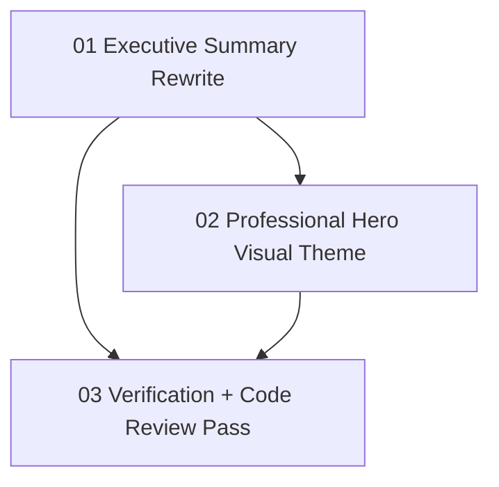

# Implementation Plan: Hero Summary Theme Refresh

**Created:** 2026-02-17
**Status:** Completed
**Total Features:** 3
**Completed:** 3/3

## Progress Summary

| ID | Feature | Status | Dependencies | Priority |
|----|---------|--------|--------------|----------|
| 01 | Executive Summary Rewrite | ✅ Completed | - | High |
| 02 | Professional Hero Visual Theme | ✅ Completed | 01 | High |
| 03 | Verification + Code Review Pass | ✅ Completed | 01, 02 | Medium |

## Dependency Graph

## Notes

- Design system source: `ui-ux-pro-max` search output (`Trust & Authority`, monochrome + blue accent).
- Target area: hero panel (`frontend/src/components/hero/*`) and global theme tokens.
